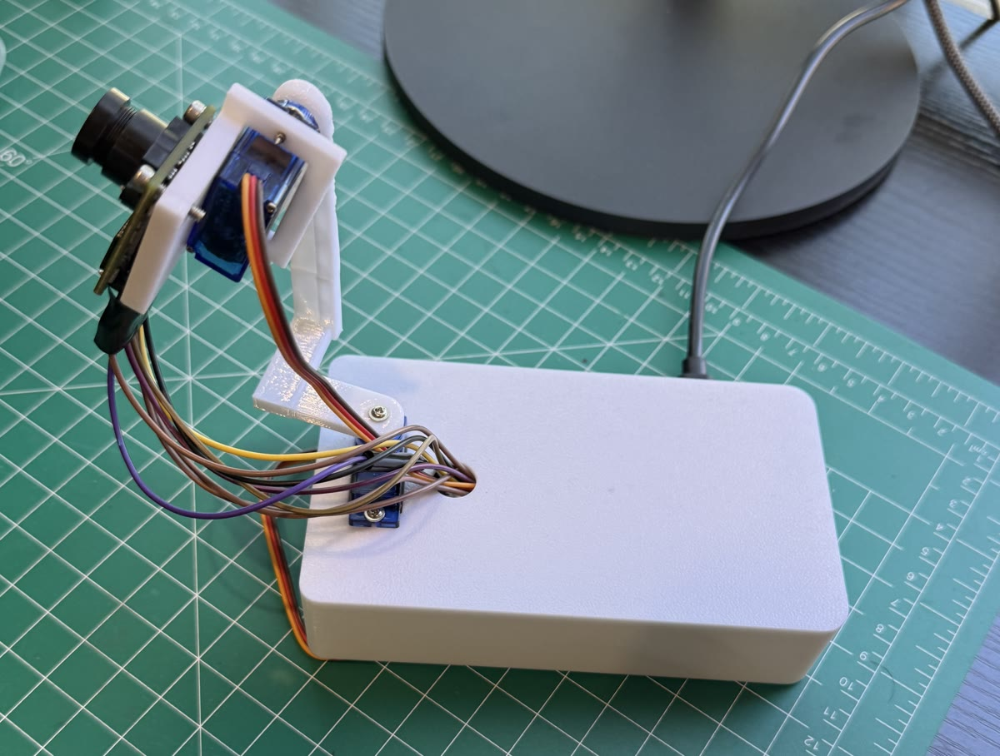

# Raspberry Pi Face Tracking Turret v1

[](https://github.com/traxrobotics/pi5-face-tracking-turret/actions/workflows/ci.yml)
[](LICENSE)


A pan and tilt camera turret that finds your face and keeps it in the middle of the picture.
Runs on a Raspberry Pi 5 with a cheap SPI camera and two SG90 servos, all wired straight
to the Pi's header. No servo driver board, no second power supply.

[](https://www.tiktok.com/@traxrobotics/video/7688967664974302495)

The assembled turret. **[Click the photo to watch it track a face.](https://www.tiktok.com/@traxrobotics/video/7688967664974302495)**

Two clips, both on TikTok: **[building it](https://www.tiktok.com/@traxrobotics/video/7688210893309562142)**
and **[tracking a face](https://www.tiktok.com/@traxrobotics/video/7688967664974302495)**.
Both are short montages rather than tutorials, and both show the physical side
only -- no terminal, no setup steps. Those are in this README and in
[`docs/`](docs/).

<!-- A looping demo.gif at docs/images/demo.gif would play inline here;
     GitHub strips video embeds, so the photo above links out instead. -->

## Features

* **Fast, smooth tracking.** Servos run their own 100 Hz motion loop with speed and braking
  limits, so they glide instead of jerking between camera frames.
* **Aims ahead of a moving face.** It measures how fast you are moving and leads you, so it
  keeps up instead of trailing behind.
* **Chases a head that flicks out of the picture.** If your face vanishes at the edge, or while
  moving fast, or leaves a blur behind as it goes, the turret turns hard that way at once.
* **Searches when you leave.** With nobody in view it sweeps slowly side to side, first
  toward the side you walked off to, and locks back on the moment it sees a face.
* **Good face detection.** Uses YuNet (OpenCV 4.8+) or an SSD model on older OpenCV, and falls
  back to Haar only if the models are missing.
* **Fixes a sideways or upside down camera by itself**, and tells you the setting to save.
* **Live view in any browser** with the detected face boxed in green.
* **Starts on boot** as a system service, with a `turret` command to start, stop and diagnose it.
* **Plain language errors.** Every failure says which pin or setting to check.
* **Tested without hardware.** A fake camera and fake servos run the whole tracker in CI.

## Hardware

| Part | Notes |
|---|---|
| Raspberry Pi 5 | Raspberry Pi OS Bookworm or Trixie |
| ArduCAM Mini 2MP Plus (B0067) | OV2640 sensor, SPI + I2C |
| 2 × SG90 micro servos | pan and tilt |
| Pan and tilt bracket | any SG90 bracket works, or print the one in [`hardware/`](hardware/) |
| 8 × female to female jumpers | camera |
| 6 × male to female jumpers | servos |
| 1000 µF electrolytic capacitor, 10 V+ | across one servo's power, stops brownout resets |

### Printed parts

Three printable parts are in [`hardware/`](hardware/) if you would rather print the
bracket than buy one: the base, the arm, and the camera attachment. Each comes as
`.3mf` to print and `.step` to edit.

The base has no floor. That keeps the servo and wiring reachable while you build,
and lets the turret bolt onto another robot's deck instead of carrying its own
bottom plate. See [`hardware/README.md`](hardware/README.md) for print settings.

## Wiring

| Wire | Pi pin |
|---|---|
| Camera VCC | 1 (3.3 V, **never 5 V**) |
| Camera SDA / SCL | 3 / 5 |
| Camera CS | 11 (GPIO17) |
| Camera MOSI / MISO / SCK | 19 / 21 / 23 |
| Camera GND | 25 |
| Pan servo signal / 5 V / GND | 32 (GPIO12) / 2 / 34 |
| Tilt servo signal / 5 V / GND | 33 (GPIO13) / 4 / 30 |

Full diagram, reasons for each pin, and assembly order: [docs/wiring.md](docs/wiring.md).

## Quick start

On the Pi:

```bash
git clone https://github.com/traxrobotics/pi5-face-tracking-turret.git ~/turret
cd ~/turret
bash setup.sh          # packages, SPI, I2C, hardware PWM
bash install_boot.sh   # start on boot + password free 'turret' command
sudo reboot
```

After the reboot, stop the background turret so the checks can use the camera, then run them in order:

```bash
turret stop
python3 test_bus.py             # camera wiring: both lines should say OK
python3 test_capture.py         # takes snapshot.jpg and measures frame rate
python3 test_servos.py          # sweeps servos, prints PAN_DIR / TILT_DIR for config.py
python3 tracker.py --no-servos  # track without moving, open the printed address in a browser
turret start                    # track for real
```

## The `turret` command

| Command | What it does |
|---|---|
| `turret status` | is it running? |
| `turret log` | watch what it is doing (Ctrl+C stops watching, not the turret) |
| `turret stop` / `start` / `restart` | control the background service |
| `turret run` | run it in this window to see everything it prints |
| `turret boot-off` / `boot-on` | stop or resume starting on boot |
| `turret doctor` | checks every piece and says exactly what is wrong |

## Settings

Everything lives in [`config.py`](config.py). The ones you are most likely to touch:

| Setting | Default | What it does |
|---|---|---|
| `PAN_DIR`, `TILT_DIR` | from `test_servos.py` | flip if it turns away from you |
| `SERVO_SPEED` | 550 | top speed, degrees per second |
| `SERVO_ACCEL` | 4500 | how hard it speeds up and brakes |
| `CHASE` | True | turn hard toward a face that just left the picture |
| `CHASE_DEG`, `CHASE_S` | 20, 0.7 | how far past the last sighting to aim, and for how long |
| `LEAD` | 1.0 | aim ahead of a moving face, 0 turns it off |
| `SWEEP` | True | search side to side when nobody is there, False waits at center |
| `SWEEP_SPEED` | 30 | search speed, degrees per second |
| `SWEEP_MIN`, `SWEEP_MAX`, `SWEEP_TILT` | 40, 140, 90 | where it searches |
| `RETURN_AFTER_S` | 2.0 | seconds with no face before it starts searching |
| `CORRECTION` | 0.9 | lower if it swings past you |
| `SPI_SPEED_HZ` | 8 MHz | drops to 4 MHz by itself if frames fail |

Symptom by symptom tuning guide: [docs/tuning.md](docs/tuning.md).

## How it works

Three loops run at once:

1. **Camera thread** grabs JPEG frames over SPI and timestamps each one.
2. **Main loop** finds the face, works out how many degrees off center it is, checks where
   the servos were pointing when that photo was taken, and sets a new aim point, a little
   ahead of you if you are moving.
3. **Servo loop** runs 100 times a second and glides both servos toward the aim point with
   smooth acceleration.

If the face vanishes near an edge, while moving fast, or leaving a blur trail in the picture,
the turret chases: it aims past the last sighting in that direction at full speed. If that
misses, it starts sweeping that way right away.

When nobody has been seen for 2 seconds, the aim point becomes the end of a slow sweep,
and the servo loop is told to cap its speed so the camera can still spot a face mid sweep.

More detail: [docs/how-it-works.md](docs/how-it-works.md).

## Project layout

```
tracker.py        main program: detection, aiming, live view
servo.py          hardware PWM servos and the smooth motion loop
arducam.py        ArduCAM Mini 2MP Plus driver for the Pi 5 (SPI + I2C)
ov2640_regs.py    sensor register tables
config.py         every setting
test_bus.py       hardware check: camera wiring
test_capture.py   hardware check: picture and frame rate
test_servos.py    hardware check: servo range and direction
setup.sh          one time install
install_boot.sh   start on boot + turret command
turret            the turret command
doctor.sh         turret doctor
models/           face detection models
tests/            automatic tests with fake hardware (no Pi needed)
docs/             wiring, tuning, troubleshooting, internals
```

## Running the tests

No Pi needed:

```bash
pip install -r requirements-dev.txt
pytest
```

The `test_*.py` files in the top folder are hardware checks for the Pi. The automatic
tests live in `tests/` and use a fake camera and fake servos.

## Roadmap

* **OLED eyes.** A 0.96" SSD1306 screen showing cartoon eyes that follow your face, blink,
  and look around while the turret searches. It can share the camera's I2C bus (it sits at
  address 0x3C, the camera at 0x30). Planned, not built yet.

## Troubleshooting

Run `turret doctor` first. It checks every piece and prints the fix.
Common problems and fixes: [docs/troubleshooting.md](docs/troubleshooting.md).

## License

MIT. See [LICENSE](LICENSE). The face detection models in `models/` keep their own
licenses, listed in [models/README.md](models/README.md).

## Author

Built by **Veer Sharma** ([@traxrobotics](https://www.tiktok.com/@traxrobotics)).
More projects, parts lists and code at [traxlinks.netlify.app](https://traxlinks.netlify.app).
